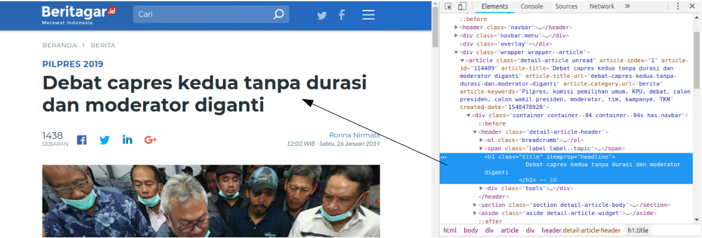
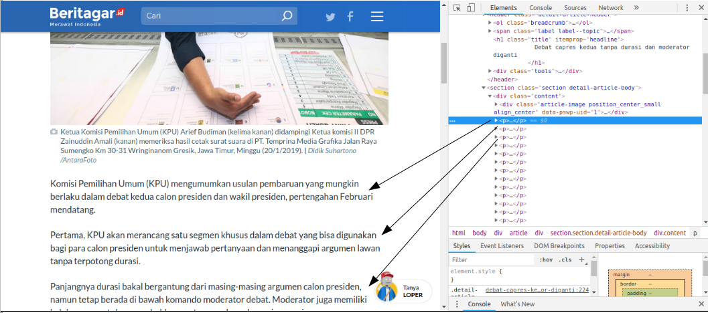
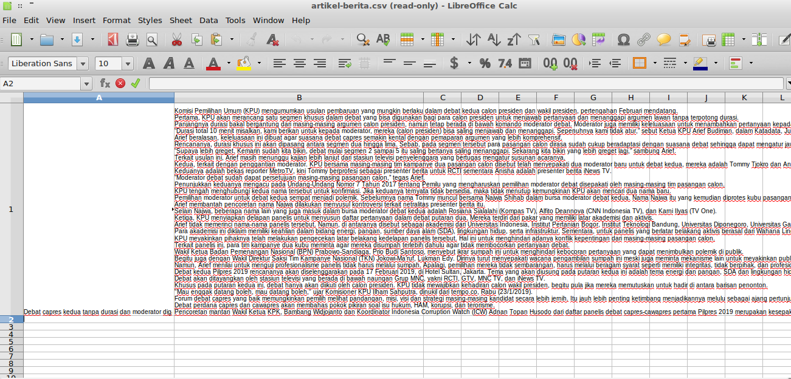
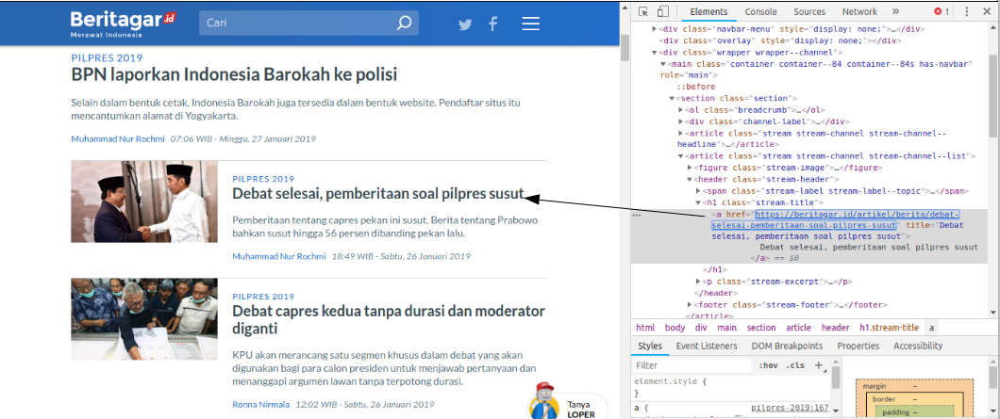
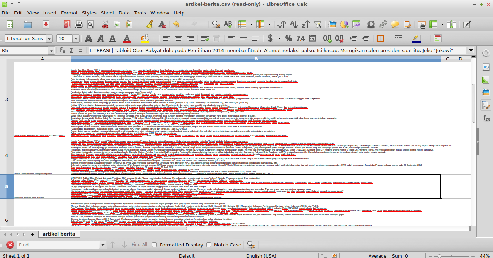

```{r setup, include=FALSE}
knitr::opts_chunk$set(echo = TRUE)
```

### Catatan

- Beberapa hasil yang diperoleh dibawah ini menggunakan R versi 3.5.2 dan RStudio versi 1.1.456 dengan OS Linux LXLE 16.04, jika terjadi perubahan hasil ketika melakukan eksekusi kemungkinan besar diakibatkan karena sistem atau perbedaan versi R 

# Instalasi Library
*Install* beberapa library berikut jika belum ada:

```{r eval=FALSE}
install.packages("rvest")
install.packages("tidytext")
install.packages("corpus")
install.packages("wordcloud2")
install.packages("dplyr")
```

Jangan lupa untuk merubah opsi ```stringAsFactors``` dengan nilai FALSE agar setiap string tidak diubah menjadi tipe faktor.

```{r}
options(stringsAsFactors = F)
```


# Let's Mining!

Untuk proses mining berikut kita akan menggunakan link ```"https://beritagar.id/artikel/berita/debat-capres-kedua-tanpa-durasi-dan-moderator-diganti"```. Contoh berikut tidak menggunakan pipe opeator ``` %>% ```. Pertama kita akan memperoleh judul dari artikel tersebut.



### Workflow tanpa menggunakan magrittr

```{r}
# Memanggil library rvest
library(rvest)
library(dplyr)

# Mengambil link lalu simpan kedalam variabel alamat_link
alamat_link <- "https://beritagar.id/artikel/berita/debat-capres-kedua-tanpa-durasi-dan-moderator-diganti"
# Lalu baca halaman web
halaman <- read_html(x = alamat_link)
# Lalu membaca node h1 dalam halaman tersebut
htmlNode <- html_node(halaman, "h1")
# Lalu membaca teks setelah teks tersebut dibersihkan dengan parameter trim = T
judul <- html_text(htmlNode, trim = T)
# Baca teks yang diperoleh dari halaman tersebut
judul
```

### Workflow dengan menggunakan ```magrittr```

```{r}
alamat_link %>% # Dari alamat link yang diberikan
  read_html() %>% # Baca html nya
  html_node("h1") %>% # lalu ambil node "h1"
  html_text(trim = T) # lalu baca teks nya
```

Dapat dilihat bahwa dengan menggunakan ```magrittr``` kita tidak perlu membuat banyak variabel sehingga lebih menghemat memori dan kode lebih mudah dibaca.

Catatan:

- Operator ``` %>% ``` dari package ```magrittr``` otomatis akan dipanggil jika memanggil library ```dplyr```
- ```html_node()``` digunakan untuk membaca 1 node pertama dari sekian banyak node, sedangkan ```html_nodes()``` digunakan untuk membaca semua node.
- ```html_node``` atau ```html_nodes``` bisa menggunakan CSS Selector, bisa juga menggunakan XPATH. Penjelasan mengenai keduanya dapat dilihat di file presentasi
- ```html_text()``` dengan parameter ```trim = T``` akan membersihkan teks yang diterima seperti menghilangkan newlines ```\n``` yang berlebih serta spasi kanan dan kiri dari teks.

Selanjutnya kita akan mencoba mengambil paragraph dari teks tersebut.



### Mengambil isi berita
Dapat dilihat dari gambar diatas bahwa terdapat lebih dari 1 node paragraph ```<p>```, maka dari itu kita akan menggunakan ```html_nodes()``` untuk mengambil teks berita.

```{r}
alamat_link %>% # Dari alamat link yang diberikan
  read_html() %>% # Baca html-nya
  html_nodes("p") %>% # Baca semua nodes "p"
  html_text(trim = T) # ambil dan bersihkan teks yang diambil
```

Jika diperhatikan, setiap paragraph diubah menjadi vektor. Hal ini akan menjadi sangat mengganggu jika kita ingin menyimpan teks tersebut kedalam file csv atau xls untuk dianalisa lebih lanjut, maka perlu menggabungkan keseluruhan vektor menjadi 1 vektor. Jika ingin menggabung berita tersebut menjadi 1 vektor tanpa harus menghilangkan paragraf dapat menggunakan fungsi ```paste0(collapse = "\n")```.

```{r}
alamat_link %>% # dari alamat link yang diberikan 
  read_html() %>% # baca html-nya
  html_nodes("p") %>% # lalu baca semua node "p"
  html_text(trim = T) %>% # lalu ambil dan bersihkan teksnya
  paste0(collapse = "\n") # Gabung semua vektor dengan menambah newlines ("\n")
```

Catatan:

- Jika anda melihat tanda ```\``` atau ```\n``` pada teks diatas itu normal karena ```\``` merupakan *escape character* sedangkan ```\n``` menandakan garis baru (*newlines*)

Bagaimana jika kita ingin mengambil sekaligus judul dan isi artikel? Kita bisa saja menyimpan judul dan isi artikel yang diperoleh kedalam variabel seperti berikut:

```{r}
# Mengambil judul
judul_berita <- alamat_link %>% # Dari alamat link yang diberikan
  read_html() %>% # Baca html nya
  html_node("h1") %>% # lalu ambil node "h1"
  html_text(trim = T) # lalu baca teks nya


# Mengambil isi artikel
isi_berita <- alamat_link %>% # dari alamat link yang diberikan 
  read_html() %>% # baca html-nya
  html_nodes("p") %>% # lalu baca semua node "p"
  html_text(trim = T) %>% # lalu ambil dan bersihkan teksnya
  paste0(collapse = "\n") # Gabung semua vektor dengan menambah newlines ("\n")

# Buat dataframe untuk menyimpan berita
df <- data_frame(judul = judul_berita, isi = isi_berita)

# Melihat isi dari df
df
```

Atau kita bisa membuat fungsi untuk memudahkan workflow, seperti berikut:

```{r}
# Buat function bernama 'ambil_berita' dengan parameter alamat_link
ambil_berita <- function(alamat_link) {
  # Mengambil judul
judul_berita <- alamat_link %>% # Dari alamat link yang diberikan
  read_html() %>% # Baca html nya
  html_node("h1") %>% # lalu ambil node "h1"
  html_text(trim = T) # lalu baca teks nya


# Mengambil isi artikel
isi_berita <- alamat_link %>% # dari alamat link yang diberikan 
  read_html() %>% # baca html-nya
  html_nodes("p") %>% # lalu baca semua node "p"
  html_text(trim = T) %>% # lalu ambil dan bersihkan teksnya
  paste0(collapse = "\n") # Gabung semua vektor dengan menambah newlines ("\n")

# Menyimpan berita kedalam dataframe df
df <- data_frame(judul = judul_berita, isi = isi_berita)
}
```


Kita dapat menggunakan fungsi dengan cara memasukkan link kedalam parameter fungsi tersebut.

```{r}
# Menggunakan fungsi ambil_berita lalu masukkan kedalam variabel df
df <- ambil_berita("https://beritagar.id/artikel/berita/debat-capres-kedua-tanpa-durasi-dan-moderator-diganti")

# Memanggil df
df
```

Hasil yang diperoleh dapat disimpan kedalam format csv seperti berikut:

```{r}
# Simpan df sebagai csv dengan nama "artikel-berita", tanpa nama row
write.csv(df, file = "artikel-berita.csv", row.names = FALSE)
```

Jika file tersebut dibuka maka hasilnya dapat dilihat sebagai berikut:




### Mengambil link berita

Sepertinya kurang menarik jika hanya mengambil 1 artikel saja sedangkan ada banyak artikel yang bisa di-*scrape*, namun kita butuh link dan rasanya sulit jika kita harus mengambil link tersebut satu persatu. Maka dari itu kita akan mencoba mengambil link berita, dalam hal ini kita akan menggunkan link ```https://beritagar.id/topik/pilpres-2019```.



Dapat dilihat bahwa masing-masing header artikel memiliki link pada elemen ```a``` dengan atribut ```href```. Kita bisa mengambil elemen href dengan fungsi ```html_attr()``` setelah ```html_nodes()``` seperti berikut:

```{r}
alamat_link <- "https://beritagar.id/topik/pilpres-2019" # Masukkan link kedalam variabel
alamat_link %>% # Dari alamat link yang diberikan
  read_html() %>% # Baca html-nya
  html_nodes("a") %>% # Ambil semua node "a"
  html_attr("href") # Lalu ambil atribut "href"
```

Jika dilihat dari hasil diatas, sepertinya banyak sekali link yang tidak kita butuhkan. Hal ini terjadi karena kita mengambil link dari atribut href tanpa memandang struktur dokumen tersebut lebih lanjut. Jika diperhatikan lebih baik lagi, kita dapat melihat bahwa elemen ```a``` berada dibawah elemen ```h1```, ```h1``` dibawah elemen ```header``` dan elemen ```header``` berada dibawah elemen ```article```. Maka dari itu kita harus mengambil atribut href dengan memperhatikan parent node, dalam hal ini article lalu header lalu h1.

```{r}
alamat_link <- "https://beritagar.id/topik/pilpres-2019"
alamat_link %>% # Dari alamat link yang diberikan
  read_html() %>% # Baca html-nya
  html_nodes("header h1 a") %>% # Ambil semua node "a" dari parent "h1" lalu parent "header"
  html_attr("href") # Lalu ambil atribut "href"
```

Atau bisa saja menggunakan elemen ```h1``` dengan memasukkan atribut ```class='stream-title'``` (lihat gambar).

```{r}
alamat_link <- "https://beritagar.id/topik/pilpres-2019"
alamat_link %>% # Dari alamat link yang diberikan
  read_html() %>% # Baca html-nya
  html_nodes("h1[class='stream-title'] a") %>% # Ambil semua node "a" dari parent "h1" dengan atribut class='stream-title'
  html_attr("href") # Lalu ambil atribut "href"
```

Jika dilihat dari hasilnya, kita sudah mendapat link sesuai yang kita inginkan. Maka dari itu kita bisa menggunakan link diatas untuk mengambil berita yang lain.

Catatan:

- Mengapa tidak memulainya dari parent ```article```? Karena elemen ```header``` hanya ada di dalam elemen ```article```, kecuali elemen ```header``` ada di dalam elemen yang lain, misalnya di dalam elemen ```span``` atau lainnya, baru penulisannya akan menjadi ```html_nodes("article header h1 a")```. 
- Mengapa tidak menggunakan XPATH? Ini masalah pilihan saja, kadang XPATH lebih mudah digunakan jika struktur HTML sangat kompleks dan perlu dibuat lebih detail dengan memasukkan unsur lain seperti ```class``` atau ```id```. Contohnya adalah sebagai berikut:

```{r}
alamat_link %>% # Dari alamat link yang diberikan
  read_html() %>% # Baca html-nya
  html_nodes(xpath = "//h1[contains(@class,'stream-title')]//a") %>% # Ambil node "a"
  html_attr("href") # Lalu ambil atribut "href"
```

Namun jika menggunakan CSS Selector lebih mudah maka cukup gunakan CSS Selector saja.

Selanjutnya kita akan membuat fungsi untuk mengambil semua link dalam halaman tersebut dan membaca semua artikel lalu simpan hasilnya dalam format csv sebagai berikut:

```{r}
ambil_link_pertopik <- function(alamat_link_topik) {
  alamat_link <- alamat_link_topik # Simpan link dalam variabel alamat_link
  alamat_link %>% # Dari alamat link yang diberikan
  read_html() %>% # Baca html-nya
  html_nodes("h1[class='stream-title'] a") %>% # Ambil semua node "a" dari parent "h1" dengan atribut class='stream-title'
  html_attr("href") # Lalu ambil atribut "href"
}
```

Fungsi diatas dapat digunakan seperti berikut:

```{r}
# Gunakan fungsi ambil_link_pertopik lalu simpan hasilnya kedalam variabel alamat_link
alamat_link <- ambil_link_pertopik("https://beritagar.id/topik/pilpres-2019")

# Panggil variabel alamat_link
alamat_link
```

Selanjutnya menggunakan perulangan ```for``` untuk mengambil setiap berita dalam link

```{r}
# Buat dataframe kosong dengan kolom judul dan isi, masukkan ke dalam variabel berita
berita <- data.frame(judul = NULL, isi = NULL)

# Buat berulangan 'for'
iterasi <- 1
for (link in alamat_link) { # Untuk setiap link dalam alamat_link
  print(paste0("Download berita ke-", iterasi, collapse = ""))
  print(paste0("link berita ", link, collapse = " "))
  df <- ambil_berita(link) # Ambil berita dalam link lalu masukkan dalam df
  berita <- rbind(berita, df) # masukkan dalam dataframe berita 
  iterasi <- iterasi + 1
}
```

Lalu simpan hasil yang diperoleh dari hasil iterasi tersebut kedalam file csv:

```{r}
# Simpan berita kedalam file csv 'artikel-berita.csv'
write.csv(berita, file = "artikel-berita.csv", row.names = FALSE)
```

Jika file tersebut dibuka maka hasilnya diperoleh sebagai berikut:



# Preprocessing!

Untuk tahap ini kita akan menggunakan dataset debat-capres1.csv dalam folder data dengan menggunakan fungsi ```read.csv()``` sebagai berikut:

```{r}
# Membaca file debat-capres1.csv lalu masukkan ke dalam variabel df
df <- read.csv(file = "./data/debat-capres1.csv", header = T)

# Melihat isi variabel df
df
```

Dengan menggunakan  ```dplyr```, kita bisa menggunakan fungsi ```select``` untuk memilih kolom tertentu, contoh seperti berikut:

```{r}
df %>% # Dari df
  select(AKTOR) # Ambil variabel AKTOR
```

Jika ingin mengetahui apa saja yang ada di dalam variabel AKTOR dapat menggunakan fungsi ```unique()```:

```{r}
df %>% # Dari df
  select(AKTOR) %>% # Ambil variabel AKTOR
  unique() # Cek apa saja yang ada di dalam AKTOR
```

Jika ingin mensortir data berdasarkan nilai tertentu bisa menggunakan fungsi ```filter()```:

```{r}
df %>% # Dari df
  filter(AKTOR == "Arief Budiman") # Filter data dengan variabel AKTOR bernilai "Arief Budiman"
```

Kita bisa saja mem-filter lebih dari 1 nilai dengan memasukkan variabel lainnya, misalkan SEGMEN II dengan AKTOR Jokowi

```{r}
df %>% # Dari df
  filter(SEGMEN == "SEGMEN II", AKTOR == "Jokowi") # Filter data dengan variabel AKTOR bernilai "Arief Budiman"
```

## Melakukan tokenizing

Kita dapat melakukan *tokennizing* dengan menggunakan fungsi ```unnest_token()``` dari library ```tidytext``` seperti berikut:

```{r}
# Ambil library tidytext
library(tidytext)

df %>% # Dari df 
  # Filter data berdasarkan SEGMEN "SEGMEN II", AKTOR "Jokowi", dengan TOPIK "Hukum dan HAM"
  filter(SEGMEN == "SEGMEN II", AKTOR == "Jokowi", TOPIK == "Hukum dan HAM") %>% 
  select(TEKS) %>% # Pilih variabel TEKS
  unnest_tokens(output = Tokenized, input = TEKS) # Tokenize TEKS dengan nama output Tokenized
```

Untuk membuat wordcloud kita butuh frekuensi dari masing-masing huruf sehingga kita harus menggunakan fungsi ```count()```.

```{r}
df %>% # Dari df 
  # Filter data berdasarkan SEGMEN "SEGMEN II", AKTOR "Jokowi", dengan TOPIK "Hukum dan HAM"
  filter(SEGMEN == "SEGMEN II", AKTOR == "Jokowi", TOPIK == "Hukum dan HAM") %>% 
  select(TEKS) %>% # Pilih variabel TEKS
  unnest_tokens(output = Tokenized, input = TEKS) %>%  # Tokenize TEKS dengan nama output Tokenized
  count(Tokenized,sort = T) # Hitung semua huruf dalam variabel Tokenized, lalu di-sort dari yang tertinggi
```

Dapat dilihat bahwa kita sudah memperoleh huruf dengan masing-masing frekuensi kemunculannya dalam TEKS. Dapat dilihat juga bahwa terdapat kata-kata seperti "yang", "kita", "ada", "ini", "di", "dan" dan kata-kata lainnya yang memperoleh frekuensi kemunculan tertinggi. Kata-kata tersebut disebut sebagai *stopword* dan biasanya dibuang agar tidak mengganggu proses pencarian topik ataupun ketika divisualisasi dengan wordcloud. Namun untuk sementara kita tidak membuang kata-kata tersebut.

```{r}
# Panggil library wordcloud2
library(wordcloud2)

df %>% # Dari df 
  # Filter data berdasarkan SEGMEN "SEGMEN II", AKTOR "Jokowi", dengan TOPIK "Hukum dan HAM"
  filter(SEGMEN == "SEGMEN II", AKTOR == "Jokowi", TOPIK == "Hukum dan HAM") %>% 
  select(TEKS) %>% # Pilih variabel TEKS
  unnest_tokens(output = Tokenized, input = TEKS) %>%  # Tokenize TEKS dengan nama output Tokenized
  count(Tokenized,sort = T) %>%  # Hitung semua huruf dalam variabel Tokenized, lalu di-sort dari yang tertinggi
  wordcloud2() # Visualisasikan menjadi wordcloud
```

Selain itu kita dapat mengubah beberapa parameter di dalam fungsi ```wordcloud2()``` misalnya parameter ```backgroundColor```, ```size``` dan ```shape```:

```{r}
df %>% # Dari df 
  # Filter data berdasarkan SEGMEN "SEGMEN II", AKTOR "Jokowi", dengan TOPIK "Hukum dan HAM"
  filter(SEGMEN == "SEGMEN II", AKTOR == "Jokowi", TOPIK == "Hukum dan HAM") %>% 
  select(TEKS) %>% # Pilih variabel TEKS
  unnest_tokens(output = Tokenized, input = TEKS) %>%  # Tokenize TEKS dengan nama output Tokenized
  count(Tokenized,sort = T) %>%  # Hitung semua huruf dalam variabel Tokenized, lalu di-sort dari yang tertinggi
  wordcloud2(size = 0.5, backgroundColor = "Dark", shape = "star") # Visualisasikan menjadi wordcloud
```

Terkait parameter lain dapat dilihat melalui dokumentasi yang dapat diakses dengan memberi tanda ```?``` dibelakangnya

```{r}
?wordcloud2
```

### Membuang Stopwords

Seperti yang sudah dijelaskan sebelumnya, *stopwords* biasanya mengganggu ketika melakukan pemodelan topik, maka dari itu kita akan membuangnya dengan menggunakan fungsi ```anti_join()```:

```{r}
# Ambil stopword dari github https://github.com/masdevid/ID-Stopwords, simpan kedalam variabel stopword
stopword <- read.csv2("stopword.csv")

# Melihat isi 10 stopword pertama
head(stopword,10)
```


```{r}
df %>% # Dari df 
  # Filter data berdasarkan SEGMEN "SEGMEN II", AKTOR "Jokowi", dengan TOPIK "Hukum dan HAM"
  filter(SEGMEN == "SEGMEN II", AKTOR == "Jokowi", TOPIK == "Hukum dan HAM") %>% 
  select(TEKS) %>% # Pilih variabel TEKS
  unnest_tokens(output = Tokenized, input = TEKS) %>% # Tokenize TEKS dengan nama output Tokenized
  anti_join(y = stopword, by = c("Tokenized" = "stopword")) %>%  # Buang stopword
  count(Tokenized, sort = T) # Hitung frekuensi setiap huruf
```

Dapat dilihat bahwa beberapa *stopword* sudah dibuang sehingga siap untuk divisualisasikan melalui wordcloud.

```{r}
df %>% # Dari df 
  # Filter data berdasarkan SEGMEN "SEGMEN II", AKTOR "Jokowi", dengan TOPIK "Hukum dan HAM"
  filter(SEGMEN == "SEGMEN II", AKTOR == "Jokowi", TOPIK == "Hukum dan HAM") %>% 
  select(TEKS) %>% # Pilih variabel TEKS
  unnest_tokens(output = Tokenized, input = TEKS) %>% # Tokenize TEKS dengan nama output Tokenized
  anti_join(y = stopword, by = c("Tokenized" = "stopword")) %>%  # Buang stopword
  count(Tokenized, sort = T) %>%  # Hitung frekuensi setiap huruf
  wordcloud2(backgroundColor = "dark", size = 0.5)
```

Berikut hasil visualisasi dari masing-masing calon pada teks debat beberapa hari yang lalu:
```{r}
df %>% # Dari df 
  # Filter data berdasarkan AKTOR "Jokowi"
  filter(AKTOR == "Jokowi") %>% 
  select(TEKS) %>% # Pilih variabel TEKS
  unnest_tokens(output = Tokenized, input = TEKS) %>% # Tokenize TEKS dengan nama output Tokenized
  anti_join(y = stopword, by = c("Tokenized" = "stopword")) %>%  # Buang stopword
  count(Tokenized, sort = T) %>%  # Hitung frekuensi setiap huruf
  wordcloud2(backgroundColor = "dark", size = 0.5)
```

```{r}
df %>% # Dari df 
  # Filter data berdasarkan AKTOR "Ma'ruf"
  filter(AKTOR == "Ma'ruf") %>% 
  select(TEKS) %>% # Pilih variabel TEKS
  unnest_tokens(output = Tokenized, input = TEKS) %>% # Tokenize TEKS dengan nama output Tokenized
  anti_join(y = stopword, by = c("Tokenized" = "stopword")) %>%  # Buang stopword
  count(Tokenized, sort = T) %>%  # Hitung frekuensi setiap huruf
  wordcloud2(backgroundColor = "dark", size = 0.5)
```

```{r}
df %>% # Dari df 
  # Filter data berdasarkan AKTOR "Prabowo"
  filter(AKTOR == "Prabowo") %>% 
  select(TEKS) %>% # Pilih variabel TEKS
  unnest_tokens(output = Tokenized, input = TEKS) %>% # Tokenize TEKS dengan nama output Tokenized
  anti_join(y = stopword, by = c("Tokenized" = "stopword")) %>%  # Buang stopword
  count(Tokenized, sort = T) %>%  # Hitung frekuensi setiap huruf
  wordcloud2(backgroundColor = "dark", size = 0.5)
```

```{r}
df %>% # Dari df 
  # Filter data berdasarkan AKTOR "Sandi"
  filter(AKTOR == "Sandi") %>% 
  select(TEKS) %>% # Pilih variabel TEKS
  unnest_tokens(output = Tokenized, input = TEKS) %>% # Tokenize TEKS dengan nama output Tokenized
  anti_join(y = stopword, by = c("Tokenized" = "stopword")) %>%  # Buang stopword
  count(Tokenized, sort = T) %>%  # Hitung frekuensi setiap huruf
  wordcloud2(backgroundColor = "dark", size = 0.5)
```

